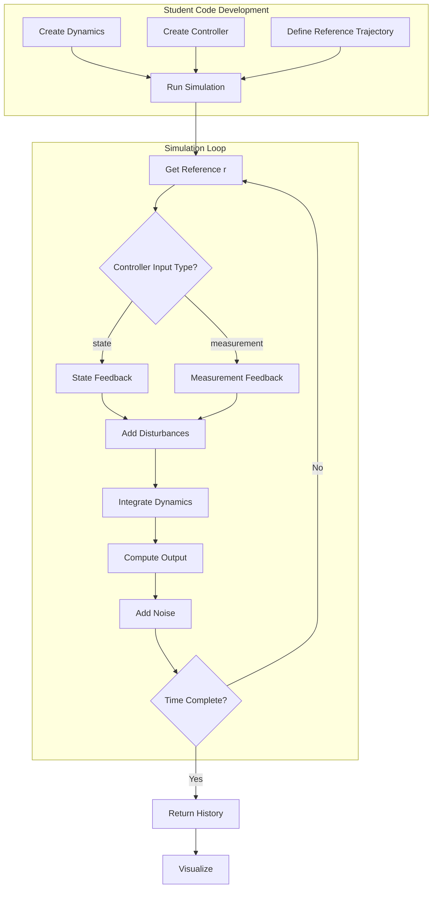
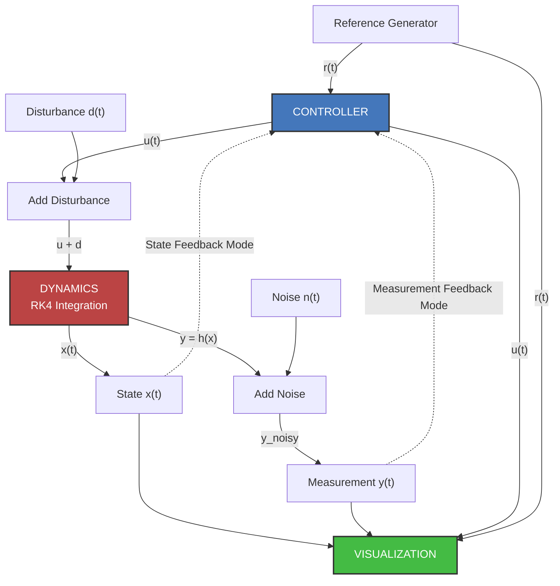
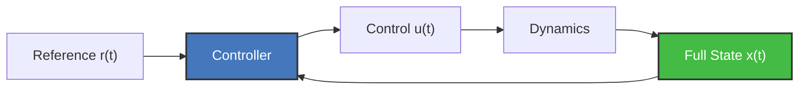
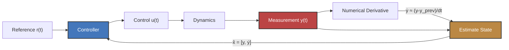
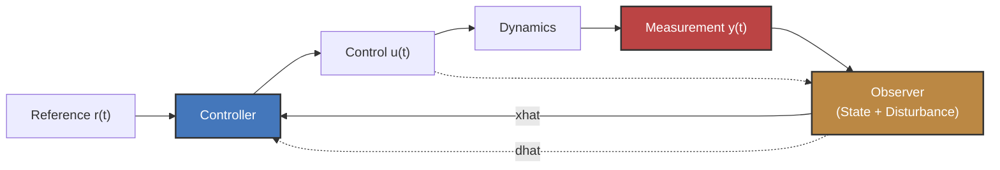
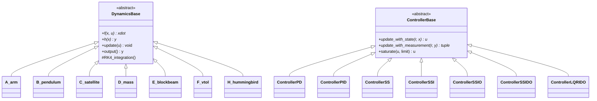

# Control Systems Architecture - Flow Diagrams

Visual representation of how dynamics, controllers, and other modules interact in this codebase.

## 1. Core Library Structure

```
┌────────────────────────────────────────────────────────────────────────────┐
│                      CORE LIBRARY (src/case_studies/)                      │
├────────────────────────────────────────────────────────────────────────────┤
│                                                                            │
│  ┌────────────────────────────────────────────────────────────────────┐    │
│  │              Case Study Implementations (A-H)                      │    │
│  ├────────────────────────────────────────────────────────────────────┤    │
│  │                                                                    │    │
│  │  ┌───────────────┐  ┌───────────────┐  ┌───────────────┐           │    │
│  │  │  A_arm/       │  │ B_pendulum/   │  │ C_satellite/  │           │    │
│  │  └───────────────┘  └───────────────┘  └───────────────┘           │    │
│  │                                                                    │    │
│  │  ┌───────────────┐  ┌───────────────┐  ┌───────────────┐           │    │
│  │  │  D_mass/      │  │ E_blockbeam/  │  │   F_vtol/     │           │    │
│  │  └───────────────┘  └───────────────┘  └───────────────┘           │    │
│  │                                                                    │    │
│  │  ┌───────────────┐                                                 │    │
│  │  │ H_hummingbird/│                                                 │    │
│  │  └───────────────┘                                                 │    │
│  │                                                                    │    │
│  └────────────────────────────────────────────────────────────────────┘    │
│                                                                            │
│  ┌────────────────────────────────────────────────────────────────────┐    │
│  │              Each Case Study Contains:                             │    │
│  ├────────────────────────────────────────────────────────────────────┤    │
│  │  • dynamics.py           - System dynamics (f, h functions)        │    │
│  │  • params.py             - Physical constants & design params      │    │
│  │  • *_controller.py       - Controller variants (PD, PID, SS, etc.) │    │
│  │  • animator.py           - Visual animations                       │    │
│  │  • visualizer.py         - Data plots                              │    │
│  └────────────────────────────────────────────────────────────────────┘    │
│  ┌────────────────────────────────────────────────────────────────────┐    │
│  │              Case Study A and B Contain:                           │    │
│  ├────────────────────────────────────────────────────────────────────┤    │
│  │  • generate_KE.py                   - finds kinetic energy         │    │
│  │  • generate_state_variable_form.py  - uses SymPy to find eom       │    │
│  │  • generate_linearization.py        - finds linear model (Chap 6)  │    │
│  │  • generate_transfer_function.py    - finds xfer function          │    │
│  └────────────────────────────────────────────────────────────────────┘    │
│                                                                            │
│  ┌────────────────────────────────────────────────────────────────────┐    │
│  │              Shared Infrastructure                                 │    │
│  ├────────────────────────────────────────────────────────────────────┤    │
│  │  • common/               - Base classes & utilities ★             │    │
│  │                            (DynamicsBase, ControllerBase,          │    │
│  │                             run_simulation, SignalGenerator)       │    │
│  │                                                                    │    │
│  │  • control/              - Control theory helpers ★               │    │
│  │                            (PD, PID, State-space, LQR   )          │    │
│  │                                                                    │    │
│  │  • _TEMPLATE/            - Student scaffolding ✓                   │    │
│  │                            (Annotated templates with TODOs)        │    │
|  |                                                                    |    |
|  |  Legend:                                                           |    |
|  |   ★  = Core infrastructure used by all systems                     |    |
|  |   ✓  = Pedagogical resources for students                          |    |
|  |                                                                    |    |
│  └────────────────────────────────────────────────────────────────────┘    │
│                                                                            │
└────────────────────────────────────────────────────────────────────────────┘
                                   │
                    ┌──────────────┼──────────────┐
                    │              │              │
                    ▼              ▼              ▼
        ┌──────────────┐  ┌──────────────┐  ┌──────────────┐
        │   chapXX/    │  │    labs/     │  │ hw_template/ │
        │  (Homework)  │  │(Hummingbird) │  │  (Student    │
        │              │  │              │  │  Examples)   │
        └──────────────┘  └──────────────┘  └──────────────┘
```

### Code Organization by Function

| Directory/Module | Purpose | Who Uses It | Key Components |
|-----------------|---------|-------------|----------------|
| **src/case_studies/common/** | Core simulation infrastructure | For all homework & labs | `DynamicsBase`, `ControllerBase`, `run_simulation()`, `SignalGenerator`, `MatplotlibAxisAnimator` |
| **src/case_studies/control/** | Controller implementations | Students developing case studies D-H | Control utility functions |
| **src/case_studies/{A-H}_*/** | Complete system implementations | Homework in chapXX imports these | System-specific dynamics, parameters, controllers (for studies A-C), visualization |
| **src/case_studies/_TEMPLATE/** | Student learning scaffolds | Students starting new systems | Heavily annotated templates with TODOs and examples |
| **chapXX/** | Student homework assignments | Students run simulations and visualizations from these | Import case_studies, instantiate controllers, run simulations |
| **labs/** | Specific to hummingbird labs | Students developing case study H | SymPy-based Lagrangian mechanics, linearization, simulation, control development |
| **hw_template/** | Example homework structure for chapXX folders | Students reference when coding | Annotated basic & advanced simulation patterns for control with state or measurements |

### Key Design Principles

1. **Import Pattern**: Students always use `from case_studies import common, A_arm` (never directly importing internals)
2. **Consistent Interface**: All systems provide `Dynamics`, `Animator`, `Visualizer`, `Controller*`, `params`
3. **Progressive Disclosure**: Complexity increases chapter-by-chapter (PD → PID → observers → LQR)
4. **Separation of Concerns**: 
   - Dynamics (physics) lives in case_studies
   - Control design lives in case_studies/{A-H} and potentially control/
   - Simulation scripts live in chapXX
   - Visualization is handled from common/ and /case_studies/{A-H}
5. **Pedagogical Scaffolding**: Templates and base classes guide students with clear error messages


## 2. Development and Simulation Flow

### High-Level System Flow



### Detailed Module Interactions



## 3. Control Modes Comparison

### Mode 1: Full State Feedback (Chapter 8)



**Assumptions**: All states are directly measurable (ideal sensors).

### Mode 2: Measurement Feedback with Numerical Derivative (Chapters 9-10)



**Approach**: Estimate velocity by numerical differentiation ("dirty derivative").

**Limitations**: 
- Amplifies sensor noise
- Requires low-pass filtering
- Less accurate than observer

**When Used**: Chapters 9-10 (PID control before observers introduced)

### Mode 3: Measurement Feedback with Observer (Chapters 12-14)



**Key Difference**: Controller only sees measurement y(t), uses observer to estimate unmeasured states.

### Summary: Three Approaches to Feedback

| Approach | Chapters | Controller Method | State Source | Pros | Cons |
|----------|----------|------------------|--------------|------|------|
| **Full State** | 8 | `update_with_state(r, x)` | Direct measurement | Simple, accurate | Unrealistic (need sensor for every state) |
| **Numerical Derivative** | 9-10 | `update_with_measurement(r, y)`<br/>→ compute ẏ<br/> | y measured,<br/>ẏ = (y-y_prev)/dt | Simple to implement | Amplifies noise, requires filtering |
| **Observer** | 12-14 | `update_with_measurement(r, y)` | Observer: x̂ = f(x̂,u) + L(y-ŷ) | Estimates all states,<br/>estimates disturbances | More complex, needs model |

## 4. Base Class Inheritance Structure




## Architecture enables:
- ✅ Consistent interface across all case studies
- ✅ Easy switching between controller types
- ✅ Modular design for adding new systems
- ✅ Clear separation of concerns (dynamics ≠ control ≠ visualization)
- ✅ Progressive learning from simple PD to advanced LQR+observers

